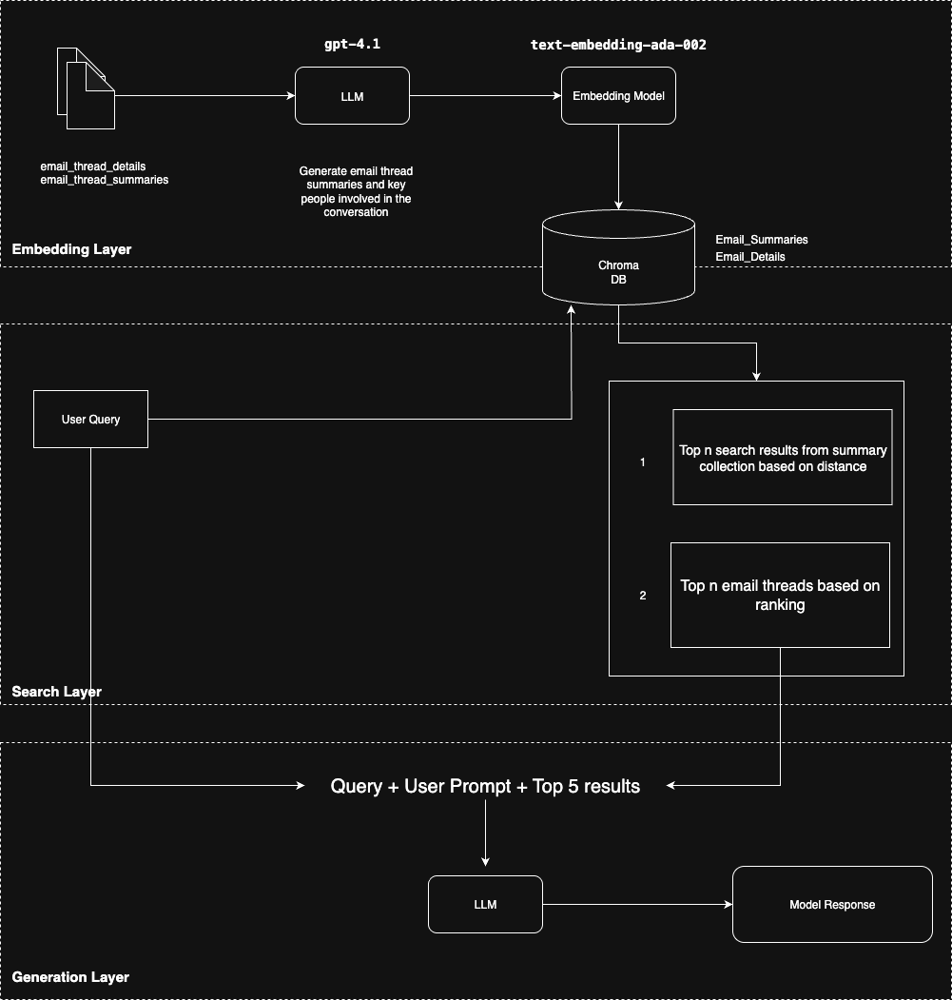
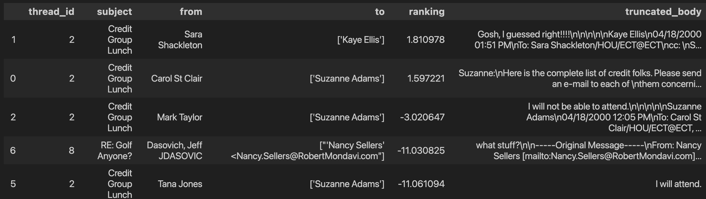
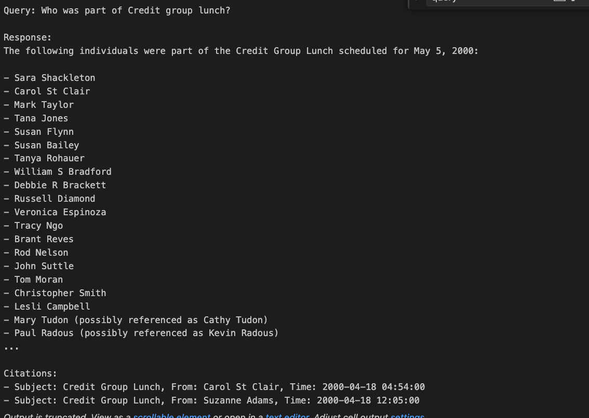
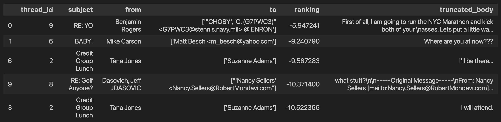
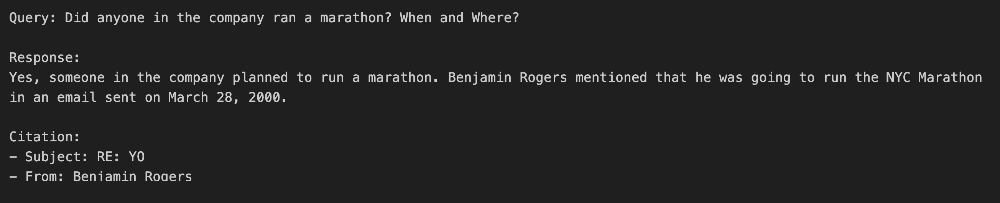
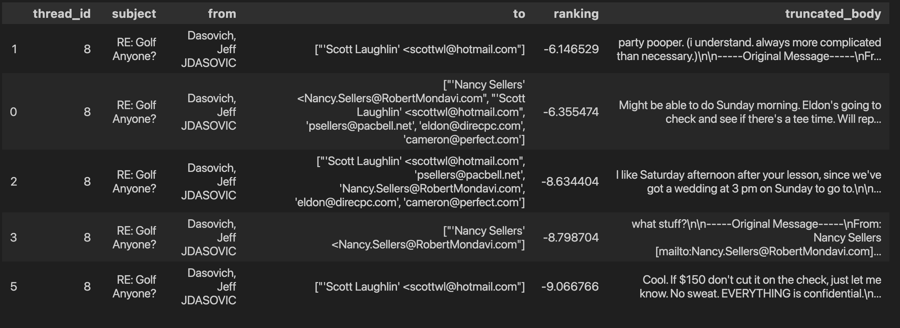
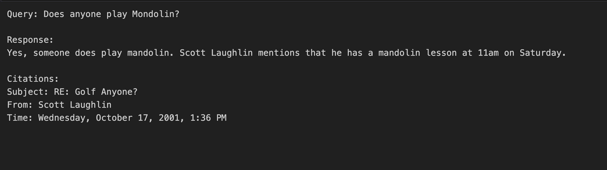

# 📧 Email Search AI — RAG over Email Threads

This project implements a **Retrieval-Augmented Generation (RAG)** system over the [Kaggle Email Thread Summary Dataset](https://www.kaggle.com/datasets/marawanxmamdouh/email-thread-summary-dataset).

---

## 🚀 Project Overview

The goal:  
Build a **generative search system** that can accurately answer questions grounded in large corpora of email threads — surfacing decisions, owners, deadlines, and action items.

The system is implemented as a **single Jupyter Notebook** (`EmailSearchAI.ipynb`) for ease of reproducibility.

---

## 📂 Dataset

We use the **Email Thread Summary Dataset** from Kaggle:

- `email_thread_details.csv` → raw messages (sender, recipients, body, timestamp, thread ID)  
- `email_thread_summaries.csv` → human-written thread-level summaries (optional, for evaluation)

Placed them in:

```
data/csv/
  ├─ email_thread_details.csv
  └─ email_thread_summaries.csv
```

---

## ⚙️ System Architecture



The pipeline has three main layers:

### 1. Embedding Layer
- **Ingestion & Cleaning**: Load and normalize email bodies from CSV.
- **Embeddings**: Use OpenAI embeddings (`text-embedding-ada-002`) for the vector database.
- **Metadata Enrichment**: Add features like text length, number of emails per thread, and key participants.
- **Vector Store**: ChromaDB (persistent client, local directory).
- **Batching**: Add documents in batches to avoid token limits.
- **Indexing**: Store summaries and email bodies in separate collections.

### 2. Search Layer
- **Querying**: Use user questions to query the vector store.
- **Hybrid Retrieval**: Query summaries for relevant threads, then fetch top-k emails from details collection.
- **Re-ranking**: Use `sentence-transformers` cross-encoder (e.g., `ms-marco-MiniLM-L6-v2`) for top results.

### 3. Generation Layer
- **Prompting**: Use OpenAI chat models (e.g., GPT-4.1) to generate summaries and answers.
- **Citation**: Responses include direct answers and evidence with proof (thread ID, date, subject).

---

---

## 🖼️ Screenshots

- *Who was part of the Credit group lunch?*



- *Did anyone in the company ran a marathon? When and Where?*



- *Does anyone play Mondolin?*



---

## 📦 Installation

```bash
git clone https://github.com/Rishabh-Saha/email-search-ai.git
cd email-search-ai

# create env
python -m venv .venv
source .venv/bin/activate

# install dependencies
pip install -r requirements.txt
```

---

## ▶️ Usage

1. Place Kaggle dataset under `data/csv/`.
2. Open `EmailSearchAI.ipynb` in Jupyter or VS Code.
3. Run cells top-to-bottom

---

## 🔑 API Keys

- Optional: OpenAI API key for embeddings or final generation
- Store in environment `.env` as `OPENAI_API_KEY`

---

## 🧩 Dependencies

Main dependencies (see `requirements.txt` for full list):
- pandas
- numpy
- torch
- transformers
- sentence-transformers
- chromadb
- openai
- tiktoken
- huggingface_hub
- matplotlib
- seaborn
- beautifulsoup4
- python-dotenv

---

## 🛠️ Troubleshooting

- **ChromaDB error: attempt to write a readonly database**
  - Ensure the `chroma_data` directory is writable (`chmod -R u+w chroma_data`)
  - Try deleting and recreating the directory
  - Make sure no other process is locking the database
  - Try changing the database path to a new directory

---

## 🧪 Sample Queries

- *“Who were the main decision-makers in the thread about the Q3 financial forecast, and what actions were agreed upon?”*

- *“Summarize the migration decision for the data warehouse (vendor, date, risks).”*  
- *“List follow-up action items assigned to Finance after November meetings.”*

---

## 📊 Future Work

- Thread-graph visualizations
- Incremental indexing (append new emails)
- PII-aware redaction
- More advanced evaluation (using provided thread summaries)

---

## 🙌 Acknowledgments

- Dataset: [Email Thread Summary Dataset on Kaggle](https://www.kaggle.com/datasets/marawanxmamdouh/email-thread-summary-dataset)  
